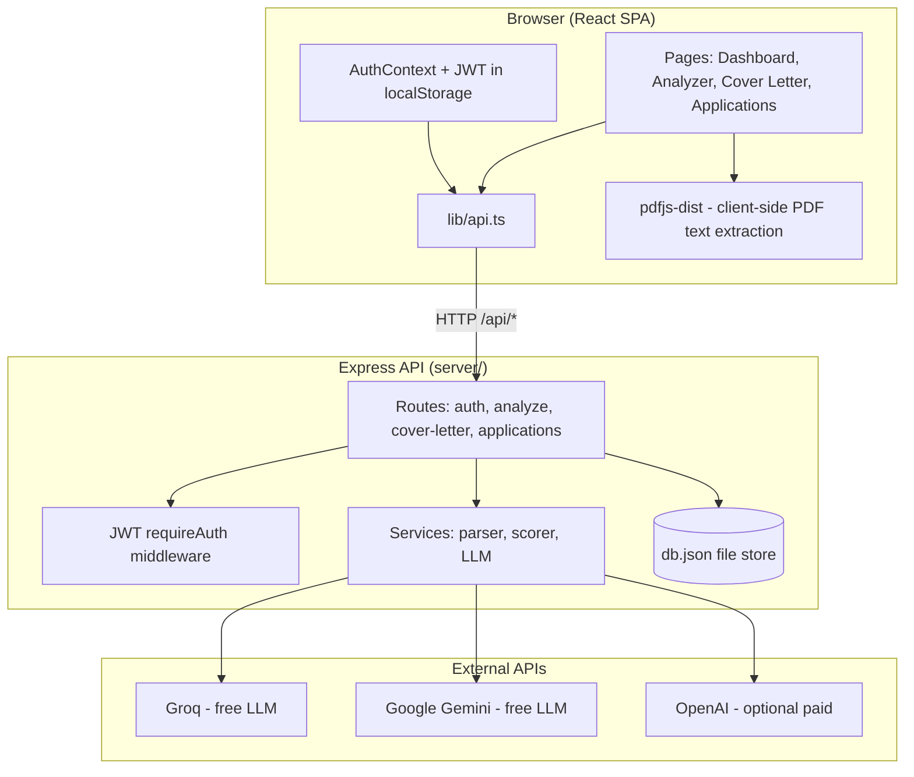
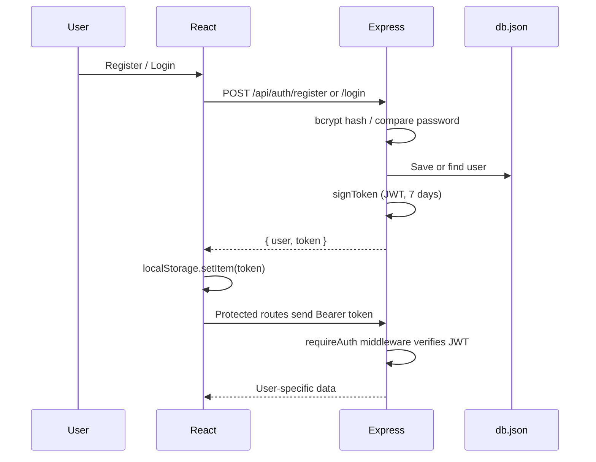
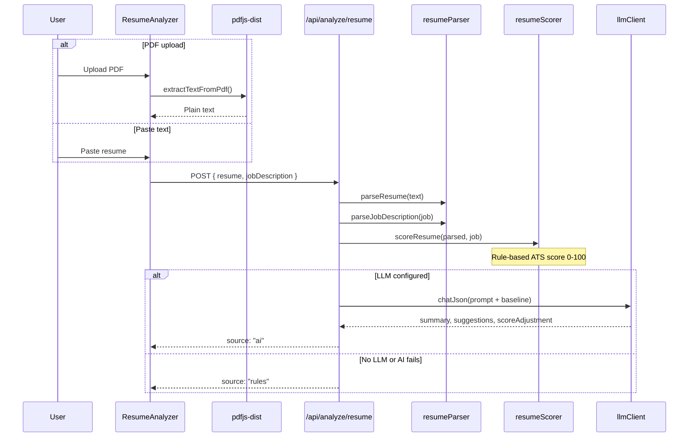
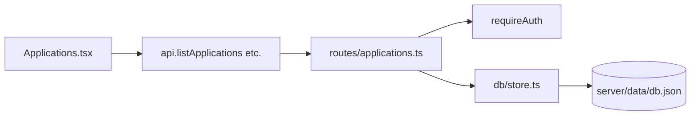

# AI Job Application Assistant — Architecture & Interview Guide

This document explains the **full system architecture** of the project so you can understand every layer and answer interview questions confidently.

---

## 1. What This Project Is

A **full-stack job search assistant** that helps users:

1. **Analyze resumes** for ATS (Applicant Tracking System) compatibility
2. **Generate cover letters** tailored to a job posting
3. **Track job applications** through a hiring pipeline

It is a **monorepo**: one repository, one `package.json`, but two logical tiers:

| Tier | Folder | Tech |
|------|--------|------|
| **Frontend (FE)** | `src/` | React 19, TypeScript, Vite, React Router |
| **Backend (BE)** | `server/` | Express 5, TypeScript, JWT, file-based DB |

In development, both run together via `npm run dev` (Vite on port **5173**, API on **3001**). Vite **proxies** `/api` requests to the backend so the frontend can call `/api/...` without CORS issues.

---

## 2. High-Level Architecture



---

## 3. Repository Structure

```
ai-job-application-assistant/
├── src/                          # FRONTEND
│   ├── main.tsx                  # App entry: Router + AuthProvider
│   ├── App.tsx                   # Route definitions
│   ├── pages/                    # Screen-level components
│   │   ├── Dashboard.tsx
│   │   ├── ResumeAnalyzer.tsx
│   │   ├── CoverLetter.tsx
│   │   ├── Applications.tsx
│   │   ├── Login.tsx
│   │   └── Register.tsx
│   ├── components/               # Reusable UI
│   ├── context/AuthContext.tsx   # Global auth state
│   ├── lib/
│   │   ├── api.ts                # All HTTP calls to backend
│   │   ├── pdfText.ts            # PDF → text (browser only)
│   │   ├── tokenStorage.ts       # JWT in localStorage
│   │   └── format.ts             # Dates, greetings, initials
│   └── types/index.ts            # Shared FE types
│
├── server/                       # BACKEND
│   ├── index.ts                  # Express app bootstrap
│   ├── routes/                   # HTTP endpoints
│   │   ├── auth.ts
│   │   ├── analyze.ts
│   │   ├── coverLetter.ts
│   │   └── applications.ts
│   ├── middleware/auth.ts        # JWT sign + verify
│   ├── services/                 # Business logic
│   │   ├── resumeParser.ts       # Parse resume structure
│   │   ├── jobParser.ts          # Parse job description keywords
│   │   ├── resumeScorer.ts       # ATS score calculation
│   │   ├── heuristicAnalyzer.ts  # Orchestrates parse + score
│   │   ├── llmClient.ts          # Multi-provider AI (Groq/Gemini/OpenAI)
│   │   └── llm.ts                # AI-enhanced analysis + cover letters
│   ├── db/store.ts               # JSON file persistence
│   ├── types.ts                  # BE types
│   └── data/db.json              # Local DB (gitignored)
│
├── public/                       # Static assets
├── vite.config.ts                # FE build + API proxy
├── package.json                  # Single dependency manifest
├── .env.example                  # Env template (committed)
└── .env                          # Secrets (NEVER commit)
```

**Interview answer:** *"We use a monorepo with a React SPA frontend and Express REST API. PDF parsing happens client-side to reduce server load; AI and scoring happen server-side to protect API keys."*

---

## 4. How Frontend & Backend Communicate

### Development

```
Browser  →  http://localhost:5173/api/analyze/resume
                ↓ (Vite proxy in vite.config.ts)
           http://localhost:3001/api/analyze/resume  →  Express
```

### Production (typical)

- **Option A:** Serve `dist/` as static files from Express and host API on same domain
- **Option B:** Deploy FE (Vercel/Netlify) and BE (Railway/Render) separately; set `CLIENT_ORIGIN` for CORS

### API client (`src/lib/api.ts`)

- Centralized `fetch` wrapper
- Attaches `Authorization: Bearer <token>` from `localStorage`
- Throws `ApiError` with message + HTTP status on failure

---

## 5. Authentication Flow



| Piece | Location | Role |
|-------|----------|------|
| Password hashing | `bcryptjs` (10 rounds) | Never store plain passwords |
| Token creation | `server/middleware/auth.ts` | `jwt.sign`, 7-day expiry |
| Token storage (client) | `localStorage` | Persists across refresh |
| Route protection (FE) | `ProtectedRoute.tsx` | Redirect to `/login` if no user |
| Route protection (BE) | `requireAuth` middleware | 401 if missing/invalid token |

**Interview answer:** *"We use stateless JWT auth. The server doesn't store sessions; it verifies the signature on each request. Passwords are bcrypt-hashed. For production I'd move tokens to HTTP-only cookies and add refresh tokens."*

---

## 6. Resume Analyzer — End-to-End Flow



### Client-side: PDF extraction (`src/lib/pdfText.ts`)

- Uses **pdfjs-dist** (loaded dynamically only when needed)
- Reads PDF in the **browser** — file never uploaded to server as binary
- Only **extracted text** is sent to the API
- Preserves line breaks for better section detection

### Server-side: Parsing (`server/services/resumeParser.ts`)

Extracts structured data from plain text:

- Contact info (email, phone, LinkedIn)
- Section headings (Experience, Education, Skills, …)
- Work roles, dates, bullet points
- Skills list and experience years

### Server-side: Scoring (`server/services/resumeScorer.ts`)

Weighted rubric (max ~100 before penalties):

| Category | Max points | What it checks |
|----------|------------|----------------|
| Contact | 10 | Email, phone, LinkedIn |
| Structure | 22 | Critical sections with content |
| Experience | 25 | Roles, dates, bullets, metrics, action verbs |
| Education | 10 | Degree, institution |
| Skills | 18 | Skills section + job overlap |
| Job match | 30 | Keyword match vs job description |

Penalties applied for missing sections, very short resumes, etc.

### AI enhancement (`server/services/llm.ts`)

**Hybrid approach** (not AI-only):

1. Always compute **rule-based baseline** first (deterministic, fast, free)
2. If LLM is configured, send baseline + resume excerpt to AI
3. AI returns: `summary`, extra `suggestions`, `scoreAdjustment` (-3 to +8)
4. Final score = baseline + adjustment (clamped 0–100)

**Why hybrid?** Reliable baseline even when AI fails; AI adds nuance and natural-language summary.

---

## 7. LLM Provider Architecture

`server/services/llmClient.ts` abstracts multiple providers:

| Provider | Env variable | Cost | Protocol |
|----------|--------------|------|----------|
| **Groq** (default in auto) | `GROQ_API_KEY` | Free tier | OpenAI-compatible API |
| **Gemini** | `GEMINI_API_KEY` | Free tier | Google REST API |
| **OpenAI** | `OPENAI_API_KEY` | Paid | OpenAI SDK |

**Auto selection order:** Groq → Gemini → OpenAI (first key found wins)

Features:

- Retry with exponential backoff on rate limits (429)
- JSON mode with fallback if provider doesn't support `response_format`
- `getLlmInfo()` exposed via `GET /api/health` for dashboard status

**Interview answer:** *"I abstracted LLM calls behind llmClient so we can swap providers via env vars without code changes. We prefer free Groq/Gemini for demos; OpenAI is optional."*

---

## 8. Cover Letter Flow

```
User inputs: resume text (+ optional PDF), job description, company name
       ↓
POST /api/cover-letter/generate
       ↓
llm.ts → generateCoverLetter()
       ↓
If LLM enabled: chatText() → AI-written letter
Else: buildTemplateCoverLetter() → static template
       ↓
Returns { letter, source: "ai" | "template" }
```

PDF upload on cover letter page uses the same `extractTextFromPdf` as the analyzer.

---

## 9. Application Tracker



**Data model per application:**

```typescript
{
  id, userId, company, role,
  status: 'saved' | 'applied' | 'interview' | 'offer' | 'rejected',
  appliedAt, notes, jobUrl,
  createdAt, updatedAt
}
```

All queries filter by `userId` from JWT — users only see their own applications.

**Interview answer:** *"It's multi-tenant by userId on every query. The JSON file store is fine for MVP; I'd migrate to PostgreSQL with proper indexes and transactions for production."*

---

## 10. Frontend Routing & Layout

```
/login, /register          → Public
/dashboard                 → Protected + Layout
/analyzer                  → Protected + Layout
/cover-letter              → Protected + Layout
/applications              → Protected + Layout
/                          → Redirect to /dashboard
```

`ProtectedRoute` waits for auth loading, then redirects unauthenticated users to `/login`.

`Layout` provides: sticky header nav, user chip, sign out, footer.

---

## 11. Complete API Reference

| Method | Endpoint | Auth | Body | Response |
|--------|----------|------|------|----------|
| GET | `/api/health` | No | — | LLM status, provider info |
| POST | `/api/auth/register` | No | `{ name, email, password }` | `{ user, token }` |
| POST | `/api/auth/login` | No | `{ email, password }` | `{ user, token }` |
| GET | `/api/auth/me` | Yes | — | `{ user }` |
| POST | `/api/analyze/resume` | Yes | `{ resume, jobDescription? }` | `{ analysis, llmEnabled, ... }` |
| POST | `/api/cover-letter/generate` | Yes | `{ resume, jobDescription, company? }` | `{ letter, source }` |
| GET | `/api/applications` | Yes | — | `{ applications[] }` |
| POST | `/api/applications` | Yes | `{ company, role, ... }` | `{ application }` |
| PATCH | `/api/applications/:id` | Yes | partial fields | `{ application }` |
| DELETE | `/api/applications/:id` | Yes | — | 204 |

---

## 12. Environment Variables

See `.env.example`. Critical rules:

- **Never commit** `.env`
- **Always commit** `.env.example` (no real keys)
- `JWT_SECRET` required (min 16 chars)
- At least one LLM key for AI features

---

## 13. Security Considerations

| Topic | Current | Production improvement |
|-------|---------|------------------------|
| Secrets | `.env` on server | Secret manager (AWS/GCP) |
| JWT storage | localStorage | HTTP-only cookies |
| Passwords | bcrypt | Same (good) |
| CORS | `CLIENT_ORIGIN` | Strict origin whitelist |
| Rate limiting | None | express-rate-limit on AI routes |
| Input size | 2MB JSON limit | Same + validation library |
| File upload | Text only (PDF parsed client-side) | Good — no binary upload attack surface |

---

## 14. Interview Questions & Sample Answers

### Q: Walk me through the architecture.

**A:** It's a React SPA talking to an Express REST API in a monorepo. Auth is JWT-based. The main features are resume ATS scoring (rule-based engine + optional LLM enhancement), cover letter generation, and a job application CRUD tracker. PDFs are parsed in the browser; only text hits the server. AI keys stay server-side via Groq/Gemini/OpenAI abstraction.

### Q: Why parse PDF on the client?

**A:** Reduces server load and complexity — no multer/file storage needed. The analyzer only needs text. pdfjs-dist runs in the browser; we send extracted text to the API. Trade-off: scanned/image PDFs won't work without OCR.

### Q: How does ATS scoring work?

**A:** We parse the resume into sections, roles, bullets, and skills. A weighted scorer evaluates contact, structure, experience quality, education, skills, and job keyword match. Penalties apply for missing critical sections. If AI is enabled, it adjusts the score slightly and adds a summary — but the baseline is always deterministic rules.

### Q: What happens if the AI API fails?

**A:** We catch the error, log it, return rule-based results with `aiFallbackReason`, and show a retry button in the UI. The user still gets a score and suggestions.

### Q: How is data persisted?

**A:** JSON file at `server/data/db.json` with synchronous read/write. Users and applications arrays. Simple for MVP; not suitable for high concurrency — I'd use PostgreSQL with Prisma or Drizzle in production.

### Q: How do you ensure users only see their own data?

**A:** JWT contains `userId`. `requireAuth` middleware attaches it to `req.auth`. Every application query filters by `userId`. PATCH/DELETE verify ownership before updating.

### Q: What would you improve for production?

**A:**
1. PostgreSQL instead of JSON file
2. HTTP-only cookies + refresh tokens
3. Rate limiting on AI endpoints
4. Redis caching for repeated analyses
5. Proper logging (Pino/Winston)
6. Unit tests for resumeParser and resumeScorer
7. CI/CD (GitHub Actions)
8. Deploy FE + BE with Docker

### Q: Why monorepo instead of separate FE/BE repos?

**A:** Single `npm install`, shared types possible, one PR for full features, simpler for MVP and interviews. For a large team, splitting repos with a shared types package can make sense.

---

## 15. Key Design Decisions (Summary)

| Decision | Choice | Reason |
|----------|--------|--------|
| Monorepo | Single repo | Simpler dev and deployment for MVP |
| API style | REST | Straightforward for CRUD + analyze endpoints |
| Auth | JWT | Stateless, easy SPA integration |
| DB | JSON file | Zero setup for local dev / demo |
| ATS scoring | Rules + AI hybrid | Reliable + enhanced when AI available |
| LLM | Multi-provider env config | Free tier friendly (Groq/Gemini) |
| PDF | Client-side extraction | No server file handling |

---

## 16. Running the Project

```bash
npm install
cp .env.example .env   # add JWT_SECRET + GROQ_API_KEY
npm run dev            # FE :5173 + BE :3001
npm run build          # Production FE build → dist/
```

---

*Last updated: reflects current codebase structure including resumeParser, resumeScorer, llmClient, PDF upload on analyzer and cover letter pages.*
